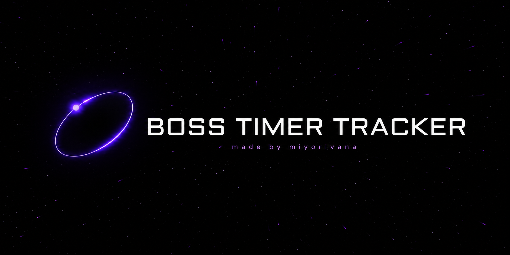
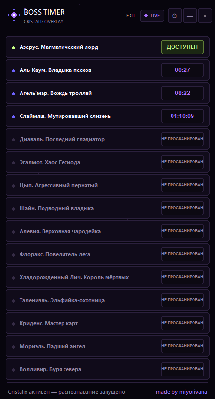
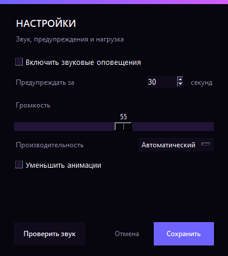

# Boss Timer Tracker

Идея **miyorivana**, воплощённая через вайбкодинг.

Boss Timer Tracker — внешний оверлей для Cristalix Prison Evo. Он распознаёт имя босса и таймер с экрана, сохраняет время появления и сортирует общий список от ближайшего босса к самому долгому.

[**Скачать Boss Timer Tracker 7.0.0**](https://github.com/miyorivana/BossTimerTracker/releases/download/v7.0.0/BossTimerTracker-Protected-7.0.0.zip)

## Как пользоваться

1. Скачайте ZIP по ссылке выше и полностью распакуйте его.
2. Не отделяйте EXE от папки `tesseract`.
3. Запустите `BossTimerTracker-Protected.exe`.
4. Откройте карточку босса в Cristalix — информация появится в оверлее автоматически.

Устанавливать Python, Tesseract или библиотеки не нужно.

## Управление

- `Ctrl+Shift+L` — переключить `LOCK/EDIT`. В `LOCK` мышь проходит сквозь оверлей; в `EDIT` его можно передвигать и настраивать.
- `Ctrl+Shift+B` — скрыть или показать оверлей.
- Колёсико мыши — прокрутить список.
- Шестерёнка — настроить звук, время предупреждения, громкость, производительность и анимации.
- Правая кнопка по строке — удалить или заблокировать ошибочный пункт, а также отключить звук для выбранного босса.

## Что умеет версия 7.0

- тёмно-фиолетовый переливающийся интерфейс;
- оконный, безрамочный и полноэкранный оверлей;
- форматы `MM:SS` и `HH:MM:SS`;
- статусы `НЕ ПРОСКАНИРОВАН` и `ДОСТУПЕН`;
- сохранение таймеров между запусками;
- 15 встроенных и пользовательские боссы;
- защита от дублей и случайного текста;
- приятное предупреждение с настраиваемым временем и громкостью;
- автоматический, экономный и быстрый режимы нагрузки.

Программа не использует инжект, DLL или чтение памяти игры. Захват экрана и OCR выполняются локально; изображения никуда не отправляются.

> Это независимый сторонний проект, не связанный официально с Cristalix или Mojang.

**made by miyorivana**
