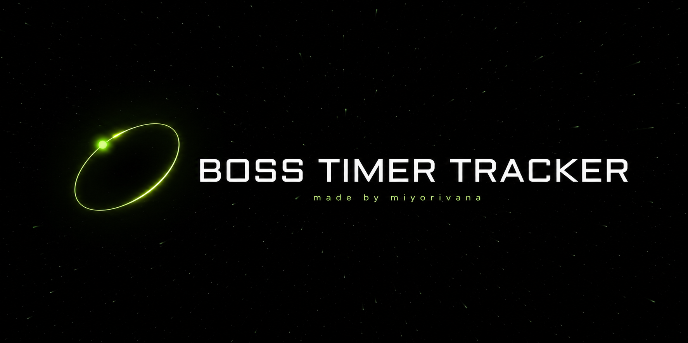
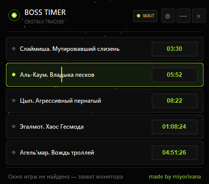

# Boss Timer Tracker

Идея **miyorivana**, воплощённая через вайбкодинг.

Boss Timer Tracker — внешнее приложение для Cristalix/Minecraft. Оно распознаёт имя открытого босса и время его появления, после чего показывает сохранённые таймеры в компактном оверлее.

## Как пользоваться

1. Скачайте ZIP из раздела **Releases**.
2. Полностью распакуйте архив. Не отделяйте EXE от папки `tesseract`.
3. Закройте прежние версии Boss Timer Tracker.
4. Запустите `BossTimerTracker-Protected.exe`.
5. Откройте карточку босса в Cristalix — имя и таймер добавятся автоматически.

Боссы сортируются от ближайшего по времени к самому дальнему. Повторное открытие карточки обновляет сохранённую информацию.

## Управление

- `Ctrl+Shift+L` — переключить режим LOCK/EDIT.
- `Ctrl+Shift+B` — скрыть или показать оверлей.

Программа не использует инжект, DLL или чтение памяти игры. Распознавание выполняется по изображению на экране.

> Это независимый сторонний проект, не связанный официально с Cristalix или Mojang.

**made by miyorivana**
